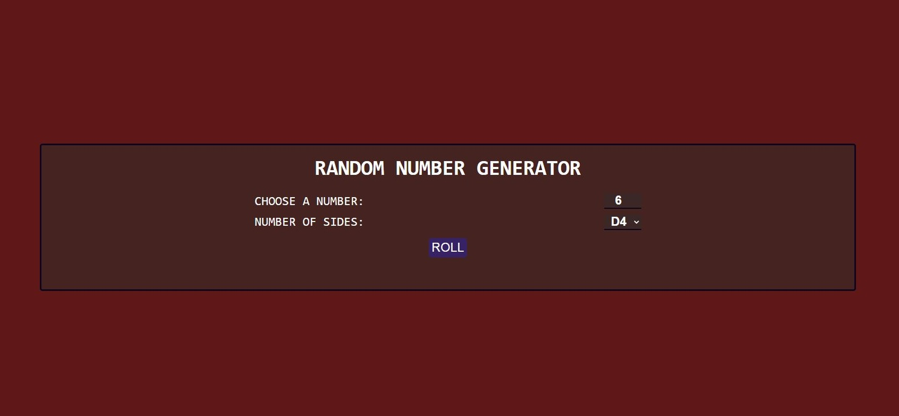

# random-dice

In this repository I use JavaScript, Css and Htlm to generate random numbers based on the number of heads the die can have.

To view the page below, I leave the link:

<a href="http://juakolp86.github.io/random-dice/" target="_blank">Random Dice</a>

Vista previa:

